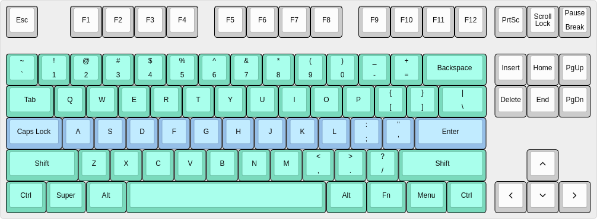
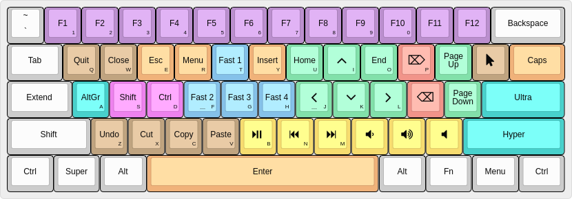

# Extended Keyboard Overlay

Custom XKB configuration that enables an additional overlay over certain keys, bringing most keystrokes closer to the [home row](https://en.wikipedia.org/wiki/Touch_typing#Home_row).

## Motivation

As a developer, the keyboard is my main work tool. Besides typing, I use it not only to navigate around text files and select/copy/paste/delete chunks of characters, but also to control many things in my operating system, like launching applications and changing the volume.

My current keyboard has the following layout:

The green keys are what I call *the main cluster*, and inside it, the blue keys are *the home row*. In order to be speed up keystrokes and to prevent unnecessary forearm movements, I want to keep both my hands within the green area and close to the blue keys most of the time.

## Solution

The solution I went with was using an *overlay*. Overlays allow some subset of the keyboard to report alternate keycodes when the overlay is enabled. XKB offers up to two independent overlays, but one was more than enough for achieving my goal.

Since overlays need to be enabled before they can be used, I remapped the CAPS LOCK key to activate *Overlay 1*, and rebranded it as *the EXTEND key*. While the EXTEND key is pressed, most keys of the main cluster are overlaid with different keycodes, as shown below (the letters on the corner of some keys are just for reference): 

Each color represents a group:

| Color | Group |
|---|---|
| | Function keys |
|  | Actions |
|  | Remaps |
|  | Navigation |
|  | Editing |
|  | Latched modifiers | 
|  | Modifiers |
|  | Fast access |
|  | Media control|

Most groups are self-explanatory, but a few deserve some notes.

### Actions

These keys emit common shortcuts that usually require multiple keystrokes:

| Key | Shortcut |
|---|---|
| Quit | Alt+F4 |
| Close | Ctrl+F4 |
| Undo | Ctrl+Z |
| Cut | Shift+Delete |
| Copy | Ctrl+Insert |
| Paste | Shift+Insert |

Clipboard actions should work just fine on most applications, including terminals.

This group also features a **mouse key** - the one with a mouse pointer inside. Its single purpose is to move the mouse cursor 50px down (or up if shift is pressed). It's handy when the cursor is covering some interesting part of the screen and you want to move it away.

### Latched modifiers

These modifiers are expected to be pressed once and then released. They will remain active until the next non-modifier key is pressed. 

**AltGr** needs no explanation. It's part of the overlay because pressing the actual key might be a little bit strenuous on the right thumb without moving the right wrist.

**Hyper** and **Ultra** enable shortcuts otherwise too awkward to be even considered: *Control+Shift+Alt* and *Control+Shift+Alt+Super*, respectively. Hyper can be used to allow extra shortcuts inside applications, or to make complicated ones easier. Ultra can help define global shortcuts that are almost guaranteed not to clash with existing ones.

### Fast access

These keys provide fast access to frequently used shortcuts. 

| Key | Shortcut | Purpose |
|---|---|---|
| Fast 1 | Ctrl+Alt+T | Opens the default terminal application |
| Fast 2 | Ultra+Space | Invokes the default launcher application |
| Fast 3 | Ctrl+B | Emits the default tmux prefix key |
| Fast 4 | Ultra+H | Opens the home folder |

## References

- [Extended Layer](https://forum.colemak.com/topic/2014-extend-extra-extreme) from [DreymaR's Big Bag of Keyboard Tricks](https://forum.colemak.com/topic/1438-dreymars-big-bag-of-keyboard-tricks-linuxxkb-files-included).
- [An Unreliable Guide to XKB Configuration](https://www.charvolant.org/doug/xkb/html/xkb.html) 
